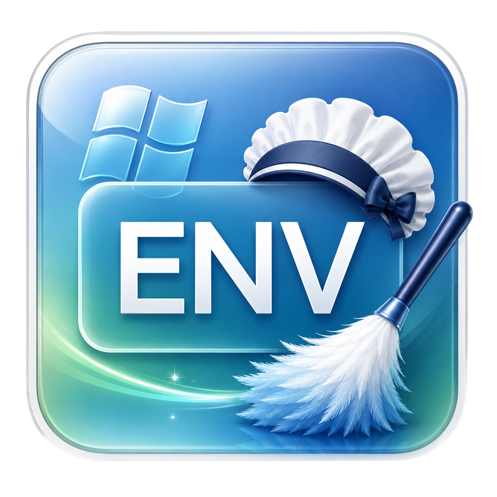
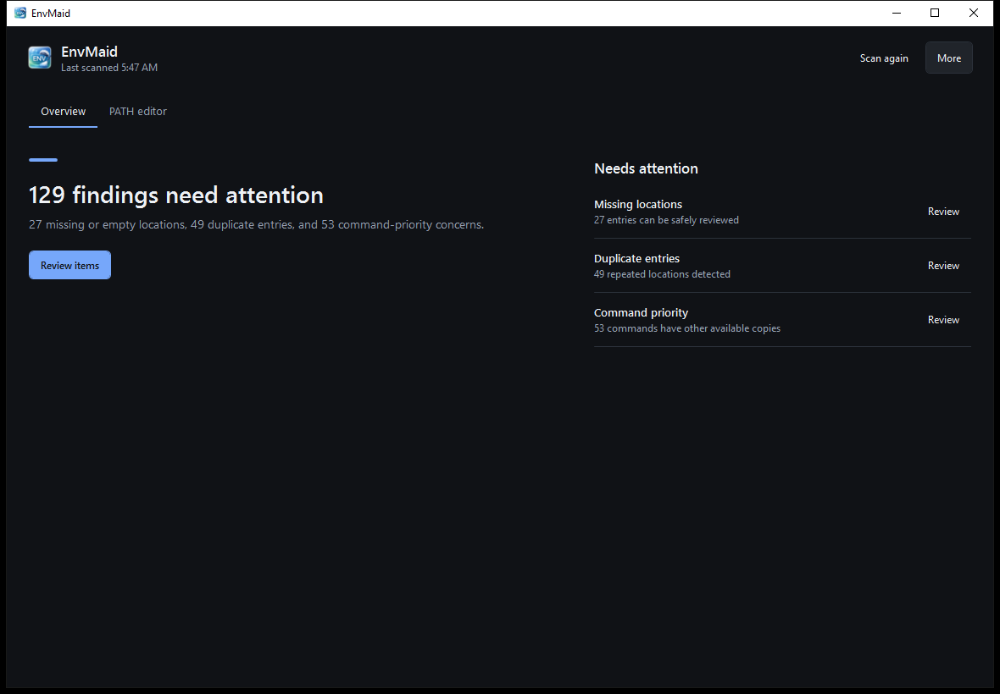

<p align="center">
  
</p>

<h1 align="center">EnvMaid</h1>

<p align="center">
  A focused Windows app for reviewing, cleaning, and safely editing your PATH environment variable.
</p>

<p align="center">
  <a href="https://github.com/ThisIsVegas/env-maid/actions/workflows/ci.yml"></a>
  <a href="https://github.com/ThisIsVegas/env-maid/releases"></a>
  
  
</p>

<p align="center">
  <a href="https://github.com/ThisIsVegas/env-maid/releases">Download</a>
  ·
  <a href="https://github.com/ThisIsVegas/env-maid/issues/new">Report a problem</a>
  ·
  <a href="#for-developers">Developer guide</a>
</p>

---

## For users

EnvMaid gives you a simple health summary first and keeps the complete PATH editor available when you need more control. It scans both User and System PATH entries, explains what needs attention, and stages every edit until you choose to save.



### What it finds

| Finding | What it means |
| --- | --- |
| Missing locations | The folder no longer exists or the entry is empty |
| Cannot read | The folder is there, but EnvMaid was not allowed to list it |
| Undefined variable | The entry uses a `%VARIABLE%` that is not defined, so Windows cannot resolve it |
| Duplicate entries | The same location appears more than once, reported at four levels of certainty |
| No executables | A folder does not contain a supported executable file |
| Command priority | More than one folder provides the same command, so Windows uses the first match |

Each entry lists every finding that applies to it, with a reason and a severity, so you can decide
what deserves action. Only findings where removing the entry is clearly the right fix are
pre-selected for you — an undefined variable is fixed by defining the variable, and a folder that
two entries reach by different routes may be deliberate.

### A safe workflow

1. Open EnvMaid to scan your current User and System PATH.
2. Start on **Overview** for a short, grouped summary.
3. Select **Review** to inspect a finding in the full PATH editor.
4. Add, edit, remove, or reorder entries. Maintenance actions show a preview before changing the staged list.
5. Select **Review and save** to inspect the exact diff before anything is written to Windows.

Changes remain staged inside EnvMaid until you confirm the final save. Before writing, EnvMaid creates a JSON backup and then notifies Windows of the updated environment settings.

If your PATH changed outside EnvMaid since the scan — an installer is the usual cause — EnvMaid
notices before writing and shows you both sets of changes rather than overwriting silently. Each
scope is handled on its own, so a surprise in one does not block the other.

> [!IMPORTANT]
> Saving System PATH changes requires administrator approval. User PATH changes do not.

> [!NOTE]
> Already-running programs keep the PATH they started with, permanently. Restart them to pick up
> your changes.

### More tools

The **More** menu keeps occasional actions out of the main workflow:

- Restore an automatic backup
- Import a PATH profile
- Export the current PATH as a profile

<details>
<summary><strong>How command priority works</strong></summary>

Windows searches System PATH before User PATH. Within each scope, entries are searched from top to bottom. If several folders contain a command with the same name, the first copy wins and later copies are shadowed.

The search is folder-by-folder: every extension in `PATHEXT` is tried in one folder before moving
to the next. So an earlier folder wins regardless of extension, and within a single folder the
`PATHEXT` order decides — which is why `foo.bat` and `foo.exe` are not unrelated files, but two
candidates for the command `foo`, only one of which ever runs.

EnvMaid models this order when identifying conflicts and shows what command coverage would be lost before a conflicting location is removed. Because resolution differs by launch mechanism, the Conflicts view states which one it simulates: a command typed at a shell prompt.
</details>

### Install and requirements

Download `EnvMaid.exe` from [GitHub Releases](https://github.com/ThisIsVegas/env-maid/releases). Release builds are self-contained, so a separate .NET installation is not required.

EnvMaid requires:

- 64-bit Windows
- Administrator approval only when saving System PATH changes

If no release is published yet, developers can run the project from source using the instructions below.

### Get help

Found incorrect detection, unexpected behavior, or a usability problem? [Open a GitHub issue](https://github.com/ThisIsVegas/env-maid/issues/new) and include:

- What you expected and what happened
- The steps needed to reproduce it
- Your Windows version
- A screenshot when it helps, with private paths removed

---

## For developers

EnvMaid is a Windows WPF application targeting .NET 10. It uses MVVM with `CommunityToolkit.Mvvm`; services are plain classes composed in `App.xaml.cs`.

### Development requirements

- Windows on x64
- [.NET 10 SDK](https://dotnet.microsoft.com/download/dotnet/10.0)
- Git

Clone and verify the project:

```powershell
git clone https://github.com/ThisIsVegas/env-maid.git
cd env-maid
dotnet restore EnvMaid.slnx
dotnet build EnvMaid.slnx --configuration Release
dotnet test src/EnvMaid.App.Tests/EnvMaid.App.Tests.csproj --configuration Release
```

Run the desktop app:

```powershell
dotnet run --project src/EnvMaid.App
```

Run a focused test:

```powershell
dotnet test src/EnvMaid.App.Tests/EnvMaid.App.Tests.csproj `
  --filter "FullyQualifiedName~ConflictAnalysisServiceTests"
```

### Architecture at a glance

| Area | Responsibility |
| --- | --- |
| `Models` | PATH entries, diagnostics, conflicts, elevation intent, and maintenance previews |
| `Services` | Registry storage, PATH semantics, analysis, ranking, diffs, and backups |
| `Services/Interop` | The P/Invoke layer, kept behind the storage seam |
| `ViewModels` | Staged editing, commands, dashboard state, and confirmation seams |
| `Views` | WPF screens and dialogs |
| `Resources` | Built-in CLI-tool knowledge used to rank command conflicts |
| `EnvMaid.App.Tests` | Pure service and view-model tests |

Storage is layered so each level can be faked from above: `EnvironmentVariableStore` is the only
class that touches the registry, `EnvironmentPathService` adds PATH semantics on top of it, and the
view models see only the latter.

Two analysis paths share the same Windows resolution model:

- Per-entry analysis attaches a list of diagnostics — missing, inaccessible, empty, unresolved
  variable, executable-free, structurally ambiguous, and four levels of duplicate.
- Grouped conflict analysis identifies the winning and shadowed providers for each command.

Both must preserve `System entries → User entries` ordering and use `ConflictRanker` as the single source of confidence ranking.

### Important implementation behavior

- Editing is staged in observable collections; the environment is untouched until save.
- Save computes a diff, asks for confirmation, backs up the values actually being replaced, verifies
  the stored value has not changed since the scan, writes, checks the read-back, and broadcasts
  `WM_SETTINGCHANGE` once for the whole save.
- A `PathEntry` stores only its raw token and derives every other form, so an untouched entry
  round-trips to the registry byte for byte and `REG_EXPAND_SZ` is never downgraded to `REG_SZ`.
- System PATH writes run in-process when already elevated; otherwise an elevated helper receives an
  ACL-protected intent file describing the baseline and the operations, then re-reads, verifies, and
  writes entirely inside the privilege boundary. The joined PATH never goes on a command line.
- Path equality is case-insensitive and normalized, and comparisons deliberately choose the expanded
  or unexpanded form — that choice is what distinguishes a true duplicate from two separately
  maintained references to the same folder.
- The CLI-tool list combines an embedded baseline with user overrides from `%APPDATA%\EnvMaid\cli-tools.txt`.

[docs/knowledge/](docs/knowledge/) holds the Windows environment-variable specification this code
implements, including empirical findings that contradict Microsoft's documentation. The `§` markers
in source comments refer to it.

See [CLAUDE.md](CLAUDE.md) for the detailed project architecture and coding conventions used by
contributors and coding agents, and [AGENTS.md](AGENTS.md) for the short agent-facing brief.

### Contributing

1. Create a focused branch from `main`.
2. Keep environment writes behind the existing confirmation and backup flow.
3. Add or update tests for behavior changes.
4. Run the Release build and complete test suite.
5. Open a pull request with the motivation, behavior change, and verification notes.

GitHub Actions builds and tests pull requests targeting `main`. For bugs and proposed features, start with a [GitHub issue](https://github.com/ThisIsVegas/env-maid/issues/new) so the behavior and scope can be discussed.

### Release process

Releases are CI-driven. Pushing a `v*` tag runs the Release workflow, builds and tests the solution, publishes a self-contained single-file `EnvMaid.exe` for `win-x64`, and attaches it to a GitHub Release after production approval.

```powershell
git tag v1.0.0
git push origin v1.0.0
```
